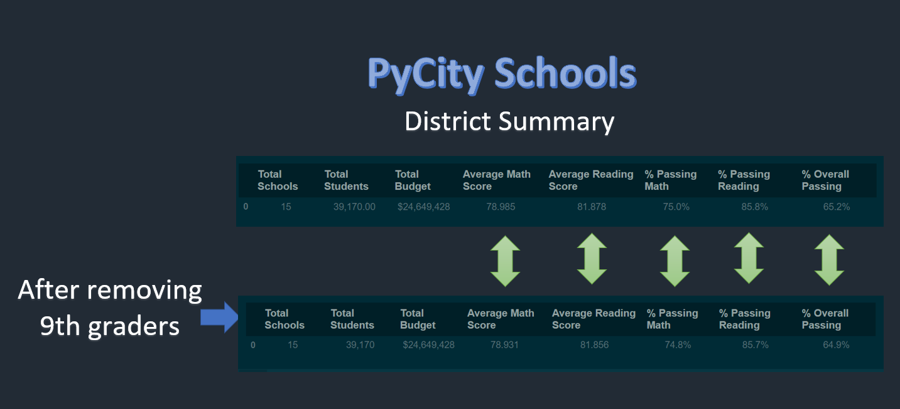

# ** PyCity Schools Analysis**

## Overview of Schools analysis

-The purpose of this project it to apply all that we learned in the module 4, in the Data analysis and visualization  Boot camp of the University of Texas at Austin.
During the this module we had the opportunity to learn the Pandas Libraries for Python. 

During the module w worked with data of  math and reading scores  15 schools
The important data we could extract was:

-Average sores for math and ready by schools and by district
-District summary
-Schools summary
-Top 5 performing schools
-Button 5 performing schools
-Summary by School size
-Summary by School size
-Summary by School type

For this challenge of the module 4 ,  I was requested to run the same analysis but removing the records of the 9th graders of Thomas High School.
	

## Results

-  We can identify there where some changes in the final numbers after removing the 9th graders. I will show the details  below.

### How is the district summary affected?

We can see in the image below that in general the district averages scores and passing averages % were lower after removing the  data.

- 

### How is the school summary affected?

Specifically for the Thomas High School, we can see the image below that after removing the  9th graders  numbers were:

Average math Score, lower
Average reading score. Slightly higher
% Passing Math : lower
% Passing Reading: lower
% Overall Passing: lower

- 

### How does replacing the ninth graders’ math and reading scores affect Thomas High School’s performance relative to the other schools?

Ranking wise it did not change the position of  Thomas High School 

-For Math score  where the average score las lower , the schools keeps its 13th position 

-For the Reading  score, where the average score was a bit higher , the schools keeps its 5thth position 

-For the overall % passing score:  where the average % was bit lower, going from %90.9 to %90.63 The school keeps its 2nd position

### How does replacing the ninth-grade scores affect the following:
Math and reading scores by grade
- 
Scores by school spending
- 
Scores by school size
- 
Scores by school type

- 

## PySchool Analysis Summary

Thanks to the analysis we could have with the data provided. we can see 5 metrics were immpacted with the 9th graders change. Total students and Total Budget remains the same.
See imega below

- 

We can also identify the 4 most important changes. See image below

- 

	

-District summary
-Schools summary
-Top 5 performing schools
-Button 5 performing schools
-Summary by School size
-Summary by School size
-Summary by School type
